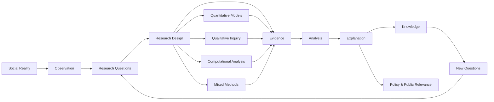

# Fariborz Aref

### Sociologist · Research Methodologist · Computational & Mixed-Methods Scholar

*The world is not random. It is structured — and so is inequality.*

United States · [Website](https://fariborzaref.com) · [ORCID](https://orcid.org/0000-0001-6622-1824)

 

[Profile](#profile) · [Research](#research) · [Methods](#methods) · [Repositories](#research-repositories) · [Publications](#selected-publications) · [Teaching](#teaching) · [Open Science](#open-science-and-reproducibility)

---

## Profile

I study how social structure produces inequality, mobility, and institutional change across time and place — and how evidence becomes explanation.

My work joins two traditions that rarely meet: the **macro structure** of inequality (Marx, Weber, Durkheim, and the comparative sociology that followed) and the **community systems** that absorb it. I move between them, combining sociological theory with computational, quantitative, and qualitative analysis.

One principle runs through all of it: good social science should make complex realities more visible, more explainable, and more accountable.

---

## Research

My work centers on the relationship between **structure, evidence, and explanation** in social inquiry.

**Core areas** — social inequality and stratification · comparative and cross-national sociology · migration, education, and global mobility · labor markets and technological change · health disparities and public policy · computational and mixed-methods sociology · research design and measurement.

**Current questions**

- Gendered labor-market inequality across welfare regimes
- Institutional responses to crisis — recession and pandemic disruption
- Migration, inequality, and demographic transition
- Computational and mixed-methods approaches to social evidence
- Research design in the age of artificial intelligence

---

## Methods

I treat methods as instruments of explanation, not decoration — the discipline that turns observation into defensible claims.

**Quantitative & computational** — Structural Equation Modeling · multilevel and longitudinal models · Generalized Estimating Equations · regression and GLM · text mining and discourse analysis · network analysis · simulation and agent-based models · reproducible visualization pipelines.

**Qualitative & mixed methods** — interviews and focus groups · ethnography and fieldwork · institutional and discourse analysis · narrative analysis · NVivo coding frameworks · mixed-methods integration and triangulation.

**Software** — `R` · `Python` · `Stata` · `SPSS` · `NVivo` · `SQL` · `LaTeX` · `Git`

<b>Technical toolchain</b>

 

**R workflows** — `tidyverse` · `data.table` · `ggplot2` · `lme4` · `lmerTest` · `lavaan` · `semTools` · `geepack` · `plm` · `fixest` · `performance` · `broom.mixed` · `quanteda` · `igraph` · `ggraph` · `psych` · `janitor` · `patchwork`

**Reproducibility** — structured project folders · codebooks and metadata · version-controlled scripts · replication files · documented analytic decisions · transparent diagnostics.

---

## Research Repositories

| Repository | Focus |
|---|---|
| [QuantitativeSocietyLab](https://github.com/fariborzaref/QuantitativeSocietyLab) | Statistical modeling, GEE frameworks, longitudinal models, quantitative pipelines |
| [QualitativeSocietyLab](https://github.com/fariborzaref/QualitativeSocietyLab) | Thematic, discourse, institutional, and NVivo-supported research |
| [MixedMethods_SocietyLab](https://github.com/fariborzaref/MixedMethods_SocietyLab) | Integration of survey, interview, ethnographic, and computational evidence |
| [ComputationalSociologyHub](https://github.com/fariborzaref/ComputationalSociologyHub) | Text mining, networks, simulation, machine learning, computational social science |
| [Teaching_and_Curriculum](https://github.com/fariborzaref/Teaching_and_Curriculum) | Syllabi, assignments, methods materials, statistics resources |
| [SociologyArchive](https://github.com/fariborzaref/SociologyArchive) | Open archive of theory, empirical research, and public scholarship |

---

## Selected Publications

- *From Recession to Pandemic: Evolving Inequalities in OECD Countries through a Two-Decade Analysis of Socio-Economic Impacts.* **Comparative Sociology**, 2024. [DOI](https://doi.org/10.1163/15691330-bja10103)
- *Analyzing Inequalities: A Multifaceted Perspective of OECD Welfare Regimes during the Great Recession and the Pandemic.* **International Review of Economics**, 2024. [DOI](https://doi.org/10.1007/s12232-024-00448-9)
- *Research Productivity in Rehabilitation, Disability, and Allied Health Programs.* **Rehabilitation Research, Policy, and Education**, 2017. [DOI](https://doi.org/10.1891/2168-6653.31.3.194)

Full record on [ORCID](https://orcid.org/0000-0001-6622-1824).

---

## Teaching

I teach students to move from question to evidence, from evidence to analysis, and from analysis to explanation — with methodological judgment at the center.

**Courses** — Research Methods · Social Statistics · Social Problems · Social Stratification · Social Inequality · Social Psychology · Social Theory · Race and Ethnic Relations · Educational Research and Evaluation.

In an age of generated answers, I focus on the distinction that still matters most: between an answer and a *defensible* one.

---

## Open Science & Reproducibility

My repositories are built around transparent, reusable workflows — clear questions, documented data decisions, codebooks and metadata, version-controlled scripts, replicable models, and interpretable use of computational tools.

The aim is not only to produce results, but to make the path from evidence to explanation visible.

---

## Conceptual Architecture

